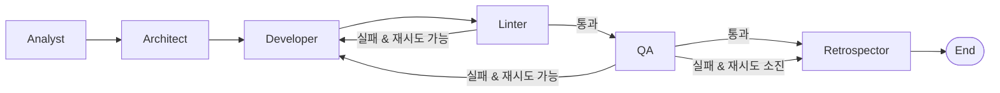

# Agentic Development Pipeline

자연어 요구사항을 입력하면 멀티에이전트 파이프라인이 분석 → 설계 → 코드 생성 → 검증 → 회고를 자동으로 수행하여 실행 가능한 FastAPI 애플리케이션을 만들어냅니다.

> **안내:** 이 데모는 파이프라인 구조를 보여주기 위한 최소 구현이며, 실제 운영 시스템의 세부 설계 및 튜닝은 비공개입니다.

---

## 파이프라인 구조

```
                      ┌──────────┐
   requirement ──────►│ Analyst  │  요구사항을 태스크로 분해
                      └────┬─────┘
                           │ tasks[]
                      ┌────▼─────┐
                      │Architect │  데이터 모델 및 API 엔드포인트 설계
                      └────┬─────┘
                           │ design doc
                      ┌────▼─────┐
              ┌───────│Developer │  FastAPI 소스 코드 생성
              │       └────┬─────┘
              │            │ code
         재시도│       ┌────▼─────┐
         (≤2회)┤        │  Linter  │  ruff 자동 수정 + 잔여 이슈 검출
              │       └────┬─────┘
              │     통과   │   실패
              │       ┌────▼─────┐
              └───────│    QA    │  구문 및 구조 검증
                      └────┬─────┘
                    통과   │   실패 (재시도 소진)
                      ┌────▼──────┐
                      │Retrospector│ 사이클 요약 및 개선점 도출
                      └───────────┘
```



---

## 에이전트 역할

| 에이전트 | 역할 | 입력 | 출력 |
|---|---|---|---|
| **Analyst** | 요구사항 분해 | 자연어 요구사항 | 태스크 목록 |
| **Architect** | 시스템 설계 | 태스크 목록 | 데이터 모델 + API 명세 |
| **Developer** | 코드 생성 | 설계 문서 (재시도 시 피드백 포함) | FastAPI Python 소스 |
| **Linter** | 정적 분석 | 생성된 코드 | ruff 자동 수정 코드 + 잔여 이슈 |
| **QA** | 코드 검증 | lint 완료 코드 | 통과/실패 + 피드백 |
| **Retrospector** | 사이클 회고 | 전체 파이프라인 상태 | 한 줄 개선점 |

---

## 기술 스택

| 구성 요소 | 라이브러리 |
|---|---|
| 에이전트 오케스트레이션 | [LangGraph](https://github.com/langchain-ai/langgraph) |
| LLM | [Anthropic Claude](https://www.anthropic.com) (`langchain-anthropic`) |
| 생성 결과물 대상 | [FastAPI](https://fastapi.tiangolo.com) |
| 린팅 & 포맷팅 | [Ruff](https://docs.astral.sh/ruff/) |
| 실행 환경 | Python 3.11+ |

---

## 빠른 시작

### 1. 클론 & 의존성 설치

```bash
git clone https://github.com/balrok12/agentic-dev-pipeline.git
cd agentic-dev-pipeline
python -m venv .venv
# Windows:  .venv\Scripts\activate
# macOS/Linux: source .venv/bin/activate
pip install -r requirements.txt
```

### 2. 환경 변수 설정

```bash
cp .env.example .env
# .env 파일을 열어 ANTHROPIC_API_KEY 입력
```

### 3. 파이프라인 실행

```bash
python src/run.py --requirement "Create a REST API for todo management with full CRUD operations."
```

생성된 FastAPI 앱은 `output/todo_api_<timestamp>.py`에 저장됩니다.

### 4. 생성된 앱 실행 (선택)

```bash
uvicorn output.todo_api_<timestamp>:app --reload
# http://localhost:8000/docs 에서 Swagger UI 확인
```

---

## 개발 환경 설정 (pre-commit)

커밋 전 자동 린팅을 활성화하려면:

```bash
pip install -r requirements-dev.txt
pre-commit install
```

이후 `git commit` 시 ruff가 자동으로 실행됩니다.

---

## 실행 결과

각 실행마다 생성되는 것:

- 각 에이전트 단계의 입출력이 콘솔에 단계별로 출력
- `output/` 디렉터리에 실행 가능한 FastAPI Python 파일 저장

전체 예시 실행 로그는 [examples/sample_run_log.md](examples/sample_run_log.md)를 참고하세요.

---

## 설정 값

| 변수 | 기본값 | 설명 |
|---|---|---|
| `ANTHROPIC_API_KEY` | *(필수)* | Anthropic API 키 |
| `MODEL_NAME` | `claude-3-5-haiku-20241022` | 사용할 Claude 모델 |
| `MAX_RETRY` | `2` | QA→Developer 최대 재시도 횟수 |

---

> 이 데모는 파이프라인 구조를 보여주기 위한 최소 구현이며, 실제 운영 시스템의 세부 설계 및 튜닝은 비공개입니다.
