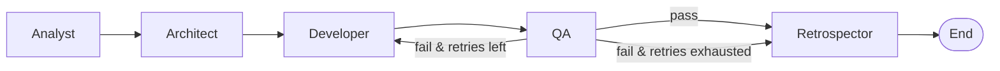

# Agentic Development Pipeline

A multi-agent development automation pipeline demo built with **LangGraph** and **Anthropic Claude**.  
Given a natural-language requirement, the pipeline autonomously analyses, designs, generates, validates, and retrospects — producing a runnable FastAPI application.

> **Note:** This demo illustrates the pipeline structure as a minimal implementation. Detailed design decisions and production tuning are not included.

---

## Pipeline Structure

```
                      ┌──────────┐
   requirement ──────►│ Analyst  │  Breaks requirement into tasks
                      └────┬─────┘
                           │ tasks[]
                      ┌────▼─────┐
                      │Architect │  Designs data model & API endpoints
                      └────┬─────┘
                           │ design doc
                      ┌────▼─────┐
              ┌───────│Developer │  Generates FastAPI source code
              │       └────┬─────┘
              │            │ code
         retry│       ┌────▼─────┐
         (≤2x)└───────│    QA    │  Validates syntax & structure
                      └────┬─────┘
                    pass   │   fail (retry exhausted)
                      ┌────▼──────┐
                      │Retrospector│ Summarises cycle, extracts improvement
                      └───────────┘
```



---

## Agent Roles

| Agent | Role | Input | Output |
|---|---|---|---|
| **Analyst** | Requirement decomposition | Natural-language requirement | Task list |
| **Architect** | System design | Task list | Data model + API spec |
| **Developer** | Code generation | Design doc (+ QA feedback on retry) | FastAPI Python source |
| **QA** | Code validation | Generated code | Pass/fail + feedback |
| **Retrospector** | Cycle summary | Full pipeline state | One-line improvement |

---

## Tech Stack

| Component | Library |
|---|---|
| Agent orchestration | [LangGraph](https://github.com/langchain-ai/langgraph) |
| LLM | [Anthropic Claude](https://www.anthropic.com) via `langchain-anthropic` |
| Generated app target | [FastAPI](https://fastapi.tiangolo.com) |
| Environment | Python 3.11+ |

---

## Quick Start

### 1. Clone & install

```bash
git clone https://github.com/balrok12/agentic-dev-pipeline.git
cd agentic-dev-pipeline
python -m venv .venv
# Windows:  .venv\Scripts\activate
# macOS/Linux: source .venv/bin/activate
pip install -r requirements.txt
```

### 2. Set up environment

```bash
cp .env.example .env
# Edit .env and add your ANTHROPIC_API_KEY
```

### 3. Run the pipeline

```bash
python src/run.py --requirement "Create a REST API for todo management with full CRUD operations."
```

The generated FastAPI app is saved to `output/todo_api_<timestamp>.py`.

### 4. Run the generated app (optional)

```bash
uvicorn output.todo_api_<timestamp>:app --reload
# Open http://localhost:8000/docs
```

---

## Output

Each run produces:

- Console output showing each agent's step-by-step progress
- A runnable FastAPI Python file in `output/`

See [examples/sample_run_log.md](examples/sample_run_log.md) for a full example run log.

---

## Configuration

| Variable | Default | Description |
|---|---|---|
| `ANTHROPIC_API_KEY` | *(required)* | Your Anthropic API key |
| `MODEL_NAME` | `claude-3-5-haiku-20241022` | Claude model to use |
| `MAX_RETRY` | `2` | Max QA→Developer retries |

---

> This demo is a minimal implementation to illustrate pipeline structure.  
> Detailed design and production-level tuning are not included.
