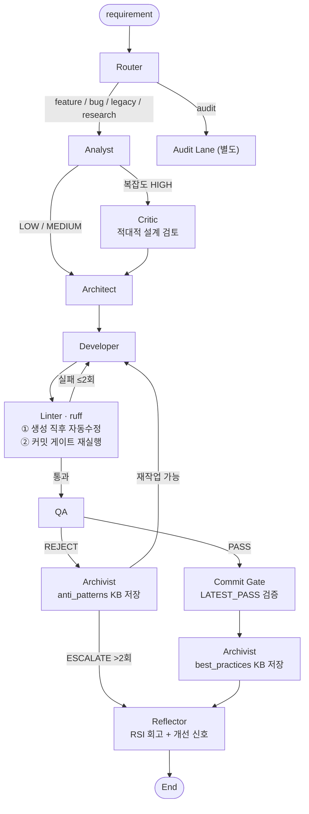

# Agentic Development Pipeline

자연어 요구사항을 입력하면 멀티에이전트 파이프라인이 분석 → 설계 → 코드 생성 → 검증 → 회고를 자동으로 수행하여 실행 가능한 FastAPI 애플리케이션을 만들어냅니다.

> **안내:** 이 데모는 파이프라인 구조를 보여주기 위한 최소 구현이며, 실제 운영 시스템의 세부 설계 및 튜닝은 비공개입니다.

---

## 파이프라인 구조

```
               requirement
                    │
              ┌─────▼──────┐
              │   Router   │  레인 분류: feature · bug · legacy · research · audit
              └─────┬──────┘
                    │
              ┌─────▼──────┐
              │  Analyst   │  태스크 분해 + 복잡도 평가 (LOW / MEDIUM / HIGH)
              └──┬──────┬──┘
             LOW/MED   HIGH
                 │    ┌──▼──────┐
                 │    │ Critic  │  적대적 설계 검토 (HIGH 전용)
                 │    └──┬──────┘
                 └───────┤
                         │
              ┌──────────▼────────┐
              │     Architect     │  데이터 모델 & API 설계
              └──────────┬────────┘
                         │
   ┌─────────────────────▼──────────────────────┐
   │               Developer                    │◄── lint / QA 실패 재작업
   └─────────────────────┬──────────────────────┘
                         │
   ┌─────────────────────▼──────────────────────┐
   │           Linter (ruff)                    │
   │  · 코드 생성 직후 자동 수정                │
   │  · 커밋 시점 lint-staged 재실행 (pre-commit)│
   └─────────────────────┬──────────────────────┘
                    통과  │  실패 → Developer 재시도 (≤2회)
   ┌─────────────────────▼──────────────────────┐
   │                   QA                       │  구문 & 구조 검증
   └──────────┬──────────────────────┬──────────┘
            PASS                  REJECT
              │                     │
              │             ┌───────▼──────────┐
              │             │    Archivist     │  anti_patterns KB 저장
              │             └──┬───────────┬───┘
              │          재작업│      >2회  │ ESCALATE
              │           Developer         │
              │                             ▼
   ┌──────────▼──────────┐           Reflector
   │     Commit Gate     │  LATEST_PASS 검증 후 커밋 허용
   └──────────┬──────────┘
              │
   ┌──────────▼──────────┐
   │      Archivist      │  best_practices KB 저장
   └──────────┬──────────┘
              │
   ┌──────────▼──────────┐
   │      Reflector      │  RSI 회고 + 개선 신호 생성
   └──────────┬──────────┘
              │
             END
```



---

## 에이전트 역할

| 에이전트 | 역할 | 비고 |
|---|---|---|
| **Router** | 입력 레인 분류 (feature/bug/legacy/research/audit) | |
| **Analyst** | 태스크 분해 + 복잡도 평가 (LOW/MEDIUM/HIGH) | ✓ 데모 구현 |
| **Critic** | 적대적 설계 검토 — 복잡도 HIGH 시에만 개입 | |
| **Architect** | 데이터 모델 & API 엔드포인트 설계 | ✓ 데모 구현 |
| **Developer** | FastAPI 코드 생성 (lint·QA 피드백 반영 재시도) | ✓ 데모 구현 |
| **Linter** | ruff 자동수정 (생성 직후) + 커밋 게이트 재실행 | ✓ 데모 구현 |
| **QA** | 구문 & 구조 검증, PASS/REJECT 판정 | ✓ 데모 구현 |
| **Commit Gate** | LATEST_PASS 파일 검증 후 커밋 허용 | |
| **Archivist** | PASS → best_practices / REJECT → anti_patterns KB 저장 | |
| **Reflector** | RSI 회고 신호 생성, ESCALATE 시 사용자 보고 | |

---

## 기술 스택

| 구성 요소 | 라이브러리 |
|---|---|
| 에이전트 오케스트레이션 | [LangGraph](https://github.com/langchain-ai/langgraph) |
| LLM | [Anthropic Claude](https://www.anthropic.com) (`langchain-anthropic`) |
| 생성 결과물 대상 | [FastAPI](https://fastapi.tiangolo.com) |
| 린팅 & 포맷팅 | [Ruff](https://docs.astral.sh/ruff/) |
| 실행 환경 | Python 3.11+ |

---

## 빠른 시작

### 1. 클론 & 의존성 설치

```bash
git clone https://github.com/balrok12/agentic-dev-pipeline.git
cd agentic-dev-pipeline
python -m venv .venv
# Windows:  .venv\Scripts\activate
# macOS/Linux: source .venv/bin/activate
pip install -r requirements.txt
```

### 2. 환경 변수 설정

```bash
cp .env.example .env
# .env 파일을 열어 ANTHROPIC_API_KEY 입력
```

### 3. 파이프라인 실행

```bash
python src/run.py --requirement "Create a REST API for todo management with full CRUD operations."
```

생성된 FastAPI 앱은 `output/todo_api_<timestamp>.py`에 저장됩니다.

### 4. 생성된 앱 실행 (선택)

```bash
uvicorn output.todo_api_<timestamp>:app --reload
# http://localhost:8000/docs 에서 Swagger UI 확인
```

---

## 실행 결과

각 실행마다 생성되는 것:

- 각 에이전트 단계의 입출력이 콘솔에 단계별로 출력
- `output/` 디렉터리에 실행 가능한 FastAPI Python 파일 저장

전체 예시 실행 로그는 [examples/sample_run_log.md](examples/sample_run_log.md)를 참고하세요.

---

## 설정 값

| 변수 | 기본값 | 설명 |
|---|---|---|
| `ANTHROPIC_API_KEY` | *(필수)* | Anthropic API 키 |
| `MODEL_NAME` | `claude-3-5-haiku-20241022` | 사용할 Claude 모델 |
| `MAX_RETRY` | `2` | QA→Developer 최대 재시도 횟수 |

---

> 이 데모는 파이프라인 구조를 보여주기 위한 최소 구현이며, 실제 운영 시스템의 세부 설계 및 튜닝은 비공개입니다.
